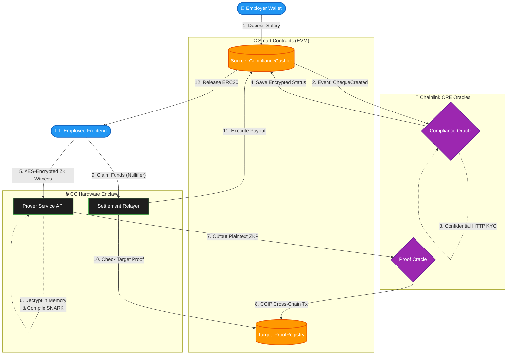

# Aletheia Protocol: Technical Architecture & Execution Flow

Aletheia is a cross-chain Privacy Payroll and Treasury Management protocol. It leverages Noir zero-knowledge SNARK proofs, Chainlink Cross-Chain Interoperability Protocol (CCIP), Chainlink Custom Runtime Extension (CRE) Oracles, and Confidential Compute (TEE) enclaves to enable completely private, cross-chain salary disbursements where employee metadata and payment amounts are cryptographically hidden.

---

## 🏗 Core Entities and Nuances

Aletheia integrates multiple complex technologies to guarantee maximum theoretical confidentiality from the browser to the blockchain.

### 1. Smart Contracts (Storage & Payouts)
*   **ComplianceCashier**: The entry point on the *Source Chain* (e.g., Base). Employers deposit funds and emit a `ChequeCreated(chequeId, owner)` event. This contract locks the funds until a relayer presents a valid ZK proof and nullifier.
*   **ProofRegistry**: The validation layer on the *Target Chain* (e.g., OP Sepolia). It acts as a mapping of `chequeId => proofHex` updated exclusively by the Chainlink Proof Oracle.
*   **Settlement Engine (within Cashier)**: Validates that `isCompliant == true` and the Proof is valid before releasing ERC20 tokens to the destination wallet.

### 2. The Chainlink CRE Network (Oracle Layer)
We use the Chainlink Custom Runtime Extension (CRE) to run WASM scripts inside the Decentralized Oracle Network (DON).
*   **Compliance Oracle**: Listens for `ChequeCreated` events. It uses **Confidential HTTP** to ping a KYC API, encrypts the compliance status inside the hardware enclave using AES-GCM, and writes the ciphertext back on-chain.
*   **Proof Oracle**: An HTTP-triggered workflow that acts as a secure bridge. Once the Off-Chain Prover generates the massive 50MB Noir SNARK proof, it pushes it to this oracle, which cleanly formats it and executes a Cross-Chain CCIP transaction to write the Proof into the `ProofRegistry` on the destination network.

### 3. The Prover Service (Confidential Compute TEE)
Because Barretenberg (`bb prove`) and Noir (`nargo`) are native C++ binaries that cannot run inside the Chainlink WASM node, the proving pipeline is decoupled into a **Standalone Hardware TEE** (e.g., AWS Nitro CLI, Marlin Oyster, or Phala Network).
*   The Express backend intercepts AES-GCM encrypted payloads from the frontend.
*   It securely provisions its decryption key via Remote Attestation, unwrapping the payload *only* inside the secure TEE memory boundary.
*   It generates the ZK Proof, purges the plaintext metadata, and posts the Proof to the Proof Oracle. No plaintext is ever leaked to the host OS.

### 4. Noir Zero-Knowledge Circuits
The Noir circuit enforces the structural integrity of the payroll system:
*   **State Roots**: Validates MPT proofs against the historic Ethereum state root.
*   **Signatures**: Verifies an ECDSA (secp256k1) signature of the `ChequeId` mapping to prevent front-running.
*   **Nullifiers**: Emits a unique Poseidon2 hash (`nullifierHash`) using the cheque details to prevent double-spending without revealing the cheque ID itself.

---

## 🌊 Protocol Data Flow

---

## 🔒 Confidentiality Guarantees

The Aletheia protocol is engineered to provide "Global Confidentiality" across all domains:

1.  **On-Chain Privacy (ZK Proofs):** The Noir SNARK circuit ensures that when the employee claims their funds on the destination chain, the smart contract does not learn *which* cheque they are cashing, preventing observers from linking the deposit to the withdrawal.
2.  **Oracle Privacy (Confidential HTTP):** Chainlink's CRE Enclave guarantees that the query to the off-chain KYC provider cannot be intercepted. The oracle *encrypts* the result inside the hardware boundary before posting it to the blockchain.
3.  **Compute Privacy (Standalone TEE):** Because the Prover Service relies on heavy C++ binaries, it runs inside an AWS Nitro/Marlin Oyster enclave. The frontend encrypts the ZK witness (salary data) with AES-GCM, and the Prover Service only decrypts it in protected memory, generates the proof, and dumps the plaintext, meaning host OS administrators cannot scrape employee data.

---

## 🛡 Regulatory & Compliance Safeguards

To operate legally within global financial systems (e.g., FATF Travel Rule, FinCEN regulations), Aletheia implements several mandatory, non-negotiable architectural checks:

### 1. Mandatory KYC & Sanctions Tunneling (AML)
Before any ZK Proof can be generated or redeemed, the system **forces** the `chequeId` through the Chainlink Compliance Oracle.
*   **The Nuance:** The smart contract `ComplianceCashier` starts with `isCompliant = false`. Even if an employer deposits funds, the employee *cannot* claim them until the Compliance Oracle successfully pings an external KYC/OFAC API (like Chainalysis or Elliptic) and writes `isCompliant = true` on-chain.

### 2. Velocity & Volume Throttling
To prevent the privacy protocol from being used as a high-speed crypto tumbler:
*   **The Nuance:** The Smart Contracts can implement daily/weekly withdrawal limits per `nullifierHash`. Even though the employee is anonymous, the deterministic `nullifierHash` acts as a hidden identity tag that allows the contract to throttle velocity without doxxing the user.

### 3. Sybil Resistance via Nullifier Hashes
To prevent double-spend attacks where a user claims the identical salary multiple times on destination chains:
*   **The Nuance:** The Noir ZK Circuit mathematically binds the `chequeId` to the `nullifierHash` using the Poseidon2 hashing algorithm. You cannot generate a valid proof without exposing the nullifier. The Target Chain strictly tracks used nullifiers into an immutable mapping to reject overlapping redemptions.

### 4. Enterprise Data Residency (GDPR/CCPA)
Because European enterprises cannot broadcast raw employee data globally:
*   **The Nuance:** By pushing the AES-GCM encryption step natively to the *Employee's Browser* and only executing the Decryption inside the Transient TEE, Aletheia legally bypasses "Data Exfiltration" regulations. No persistent databases store the plaintext salary amounts or PII—meaning the protocol has zero regulatory footprint regarding Data Residency laws.
