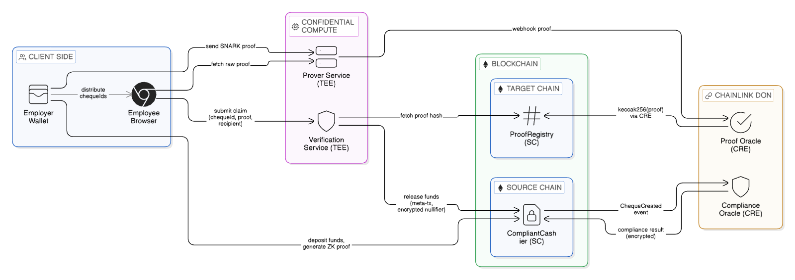
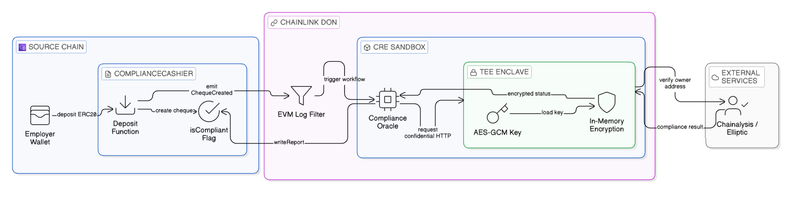
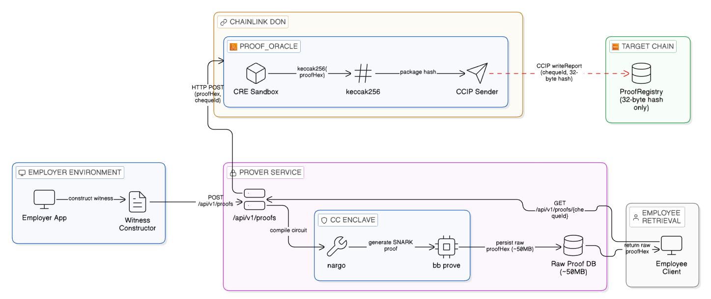
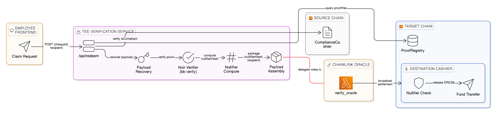
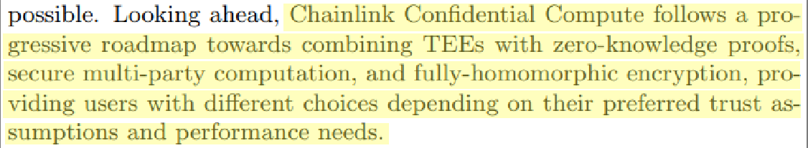
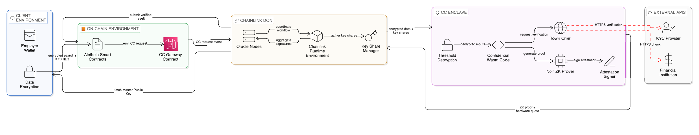

# Aletheia: Cross-Chain Privacy Payroll & Treasury Protocol

> **Enabling completely private salary payments across blockchains.**
> With Aletheia, employers can pay their teams securely while keeping employee identities, metadata, and payment amounts completely invisible to the public.

[Read the Whitepaper](https://drive.google.com/file/d/1gEUKmzvZAz9L-JAOWYZQE5cD14l0Jwvr/view?usp=sharing) | [Watch Demo](https://youtu.be/rY1gX3ybIEI) | [Live App](https://aletheia-brown-seven.vercel.app/)

Aletheia is a powerful tool designed to solve a major problem in Web3: **how do companies pay employees on a public blockchain without exposing everyone's salary to the world?** 

By combining Zero-Knowledge Proofs (Noir), Chainlink's Cross-Chain Interoperability Protocol (CCIP), and secure cloud hardware (Trusted Execution Environments), Aletheia lets employers deposit funds on one blockchain and allows employees to withdraw them on another, without anyone being able to connect the deposit to the withdrawal.

---

## Overall Architecture

Aletheia's operations are broken down into a few distinct areas to maximize security and privacy:
1. **The Users (Client Side)**: The Employer's Wallet and the Employee's Web Browser.
2. **The Blockchains (On-Chain)**: Where funds are held. A Source Chain (like Base) for deposits, and a Target Chain (like Optimism) for withdrawals.
3. **The Secure Oracles (Chainlink DON)**: Chainlink networks that run private operations (like KYC checks) without leaking data.
4. **The Secure Enclaves (Hardware TEE)**: Highly protected cloud servers that handle the heavy math (Zero-Knowledge proofs) so the user's browser doesn't crash.



---

## How Aletheia Works (Simply Explained)

Aletheia solves the privacy problem in three easy-to-understand phases. It bypasses the limits of web browsers and keeps sensitive data off public blockchains.

### Phase 1: The Deposit & The Privacy Gate

Public blockchains naturally want to show everyone's data. To stay legally compliant without publicly identifying employees, Aletheia intercepts the initial deposit and forces it through a secure background check.

*   **The Problem:** Normal blockchain "Oracles" that check things like KYC (Know Your Customer) will accidentally leak that data into public server logs.
*   **The Aletheia Solution:** When an employer deposits a salary, Chainlink wakes up a special **Compliance Oracle**. This oracle securely checks external KYC/Sanctions databases from inside a protected vault. It encrypts the "Thumbs Up" or "Thumbs Down" result and puts only that secret code on the blockchain. The employee is approved, but their identity is never revealed.



### Phase 2: Generating the "Secret Proof"

To prove an employee is owed money without revealing who they are, the system uses a Zero-Knowledge (ZK) Proof. But making this proof involves complex math that creates a massive 50MB file, enough to freeze most computers and cost thousands in blockchain gas fees.

*   **The Problem:** Blockchains are too slow and expensive to store massive 50MB proof files.
*   **The Aletheia Solution:** We move the heavy lifting off the blockchain. The employer's secure backend generates the massive 50MB proof and saves it privately. Then, Chainlink steps in again. It takes that massive proof, shrinks it down into a tiny 32-byte "fingerprint" (a hash), and sends *only* that tiny fingerprint over to the destination blockchain using Chainlink CRE Service. 



### Phase 3: The Private Withdrawal

When the employee is ready to claim their salary on the new blockchain, they need to prove they own the money without giving away their name.

*   **The Problem:** If an employee just clicks "withdraw" on the blockchain, everyone can see their wallet address and link it back to the employer's deposit, ruining the privacy.
*   **The Aletheia Solution:** The employee signs a secret digital permission slip off-chain. Our highly secure **Verification Server** takes this slip, checks the math against the tiny fingerprint we saved in Phase 2, and then talks to the blockchain *on behalf* of the employee. The blockchain releases the funds directly to the employee, but the public record never shows how the employee was connected to the original employer deposit.



---

## Core Privacy Safeguards

- **On-Chain Privacy (ZK Proofs)**: Math guarantees that the destination blockchain cannot link an employee's withdrawal to the employer's original deposit.
- **Oracle Privacy (Chainlink CRE)**: Background checks and KYC are handled in secret secure tunnels, so identities are never scraped or intercepted.
- **Compute Privacy (Secure Enclaves / TEEs)**: The heavy math happens inside isolated hardware vaults. This ensures raw personal data is never leaked, helping companies easily comply with strict data laws like GDPR.
- **Spam Protection Without Identity**: The system uses hidden math codes (Nullifiers) to ensure an employee can't withdraw their salary twice, managing security without ever knowing the user's name.

> *"Looking ahead, Chainlink Confidential Compute follows a progressive roadmap towards combining TEEs with zero-knowledge proofs, secure multi-party computation, and fully-homomorphic encryption, providing users with different choices depending on their preferred trust assumptions and performance needs."*
>
> — **Chainlink Confidential Compute Whitepaper**



---

## The Chainlink Oracles (CRE Workflows)

Aletheia heavily relies on Chainlink's Custom Runtime Extension (CRE) to run secure, decentralized programs (Oracles) that handle sensitive tasks off the main blockchain:

| Oracle | What it does | Why it's important |
| :--- | :--- | :--- |
| **`compliance_oracle`** | Pings background check APIs when an employer deposits funds. | Uses "Confidential HTTP" so the employee's background check request is never logged publicly. |
| **`proof_oracle`** | Receives the massive 50MB Secret Proof and crushes it down into a tiny 32-byte fingerprint. | It costs over $1,000 in gas fees to put a 50MB file on Ethereum. Putting a 32-byte fingerprint costs less than $1. |
| **`verify_oracle`** | Takes the employee's withdrawal request, double-checks the math against the fingerprint, and releases the funds. | Ensures the withdrawal is authorized without the employee having to reveal their real wallet address to the public. |
| **`truth_oracle`** | Runs every 30 minutes to synchronize the history of different blockchains. | Ensures the Target Chain (where withdrawals happen) has up-to-date information about deposits on the Source Chain. |
| **`rebalance_oracle`** | Monitors the balances in the liquidity pools across different chains and moves funds when necessary. | Ensures that there is always enough money on the Target Chain for employees to successfully withdraw their salaries. |

---

## Live Workflow Executions (Testnet)

Aletheia's decentralized oracles are actively processing events across testnets. Below are recent execution logs from the Chainlink CRE simulator demonstrating each oracle in action.

### Compliance Oracle
Triggered by an EVM log when an employer deposits funds, verifying off-chain KYC conditions.
- **Trigger Type**: EVM Log (`evm:ChainSelector:5224473277236331295@1.0.0`)
- **Action**: Writes compliance report to the destination vault.
- **Transaction Hash**: [0x1806450affb5086ff3a13bca3b74e9c32c49df2817af733182cf85e856dd3397](https://sepolia-optimism.etherscan.io/tx/0x1806450affb5086ff3a13bca3b74e9c32c49df2817af733182cf85e856dd3397) (Optimism Sepolia)

```text
[ComplianceOracle] Event Detected! Owner: 0x7F...0E, Cheque: 0x1ddb...
[ComplianceOracle] Successfully generated compliance status for 0x1ddb99d7a70c45657eec5aa1f6def349649b5057e232070e66c5f77fa70a0858.
[ComplianceOracle] Writing report to ethereum-testnet-sepolia-optimism-1 (0xC0d7A1253E9Bc2e3a78A417F2c7B06EdeE525018)...
[ComplianceOracle] Report Write Result: Status=2, Hash=0x1806450affb5086ff3a13bca3b74e9c32c49df2817af733182cf85e856dd3397
```

### Proof Oracle
Triggered directly via HTTP passing the massive 50MB zero-knowledge proof generated by the Prover Service.
- **Trigger Type**: HTTP API (`http-trigger@1.0.0-alpha`)
- **Action**: Compresses the ZK proof to a 32-byte hash and writing it to the destination registry.
- **Transaction Hash**: [0xb746394ebde752960dfcea9b4fe2e183a4f240891daa098ca2dbec6ba43dcd96](https://sepolia.basescan.org/tx/0xb746394ebde752960dfcea9b4fe2e183a4f240891daa098ca2dbec6ba43dcd96) (Base Sepolia)

```text
[ProofOracle] Received HTTP Trigger. Parsing payload...
[ProofOracle] Processing proof for Cheque: 0x1ddb99d7a... on Chain ID: 84532
[ProofOracle] Proof keccak256 hash: 0x626791287223b435b617fc2790ef8d51d2186ff985ded22ebac891ff7a1a7e3e
[ProofOracle] Writing report to ethereum-testnet-sepolia-base-1 (0x9FcdD7C57C515B5aec910e7E7B6B0d62A09000bd)...
[ProofOracle] ✅ Tx Success | Hash: 0xb746394ebde752960dfcea9b4fe2e183a4f2408... | Status: 2
```

### Truth Oracle
Triggered by new deposit events, acting as a lightweight relayer of state roots.
- **Trigger Type**: EVM Log (`evm:ChainSelector:5224473277236331295@1.0.0`)
- **Action**: Synchronizes block headers with the target chain for MPT storage proof verification.
- **Transaction Hash**: [0x962073bb4fd7ea9e69dd5ba598a2a180a8e13403119da6f38429d53ad1e53d8a](https://sepolia.basescan.org/tx/0x962073bb4fd7ea9e69dd5ba598a2a180a8e13403119da6f38429d53ad1e53d8a) (Base Sepolia)

```text
[TruthOracle] Event Detected! Target Chain: 84532, Block: 40581276
[TruthOracle] Fetched Header from ethereum-testnet-sepolia-optimism-1: Block #40581276, Hash: 0x2ff1f617...
[TruthOracle] Writing report to ethereum-testnet-sepolia-base-1 (0xF47F1A8CC7291CA46Bb8228C7942BC96854B8003)...
Workflow Simulation Result: "Success: Report written. Tx Status: 2"
```

### Verify Oracle
Triggered via HTTP, representing the employee requesting withdrawal of funds.
- **Trigger Type**: HTTP API (`http-trigger@1.0.0-alpha`)
- **Action**: Verifies off-chain withdrawal signatures and releases funds to the employee anonymously.
- **Transaction Hash**: [0xc0de588b144f8a85b388938fc295900538b9b87580bf01bcc8e5dacbeb2ba956](https://sepolia.basescan.org/tx/0xc0de588b144f8a85b388938fc295900538b9b87580bf01bcc8e5dacbeb2ba956) (Base Sepolia)

```text
[VerifyOracle] Received redemption request.
[VerifyOracle] Verification Request | Cheque: 0x1ddb99d7... | Recipient: 0x7F24... | Amount: 1000000
[VerifyOracle] Computed proof hash: 0x626791287223b435b617fc2790ef8d51d2186ff985ded22ebac891ff7a1a7e3e
[VerifyOracle] Writing release report to ethereum-testnet-sepolia-base-1 (0xf44d925116aD93Ddf3A634eCcFF01a59f4b2679b)...
Workflow Simulation Result: "Success: Release report written for cheque ... Tx Status: 2. Tx Hash: 0xc0de588b144f8a85b388938fc295900538b9b87580bf01bcc8e5dacbeb2ba956"
```

### Rebalance Oracle
Scheduled periodically to maintain adequate liquidity across all supported chain vaults.
- **Trigger Type**: Time-based Cron (`cron-trigger@1.0.0`)
- **Action**: Computes cross-chain deficits and initiates CCIP liquidity transfers.
- **Transaction Hash**: [0x9f319764aa5f907f35cfcd25434c047ab74e00ee06866141fa744cce6c0f1fa0](https://sepolia.etherscan.io/tx/0x9f319764aa5f907f35cfcd25434c047ab74e00ee06866141fa744cce6c0f1fa0) (Ethereum Sepolia)
- **CCIP Explorer**: [View CCIP Message](https://ccip.chain.link/tx/0xa421ec560e6f85189e9bb95efb0c20861e68cc6470525df6fc3389ca5921ce22) (Ethereum Sepolia)

```text
[RebalanceOracle] Cron triggered at 2026-03-08T12:22:39.924Z. Beginning distributed health check...
[RebalanceOracle] PASS 1: Fetching liquidity states from all networks...
[RebalanceOracle] PASS 2: Calculating optimal routing...
[RebalanceOracle] ROUTING DECISION | Source: ethereum-testnet-sepolia (23000000 Surplus) -> Dest: ethereum-testnet-sepolia-arbitrum-1 (10000 Deficit) | Amount: 10000
Workflow Simulation Result: "[RebalanceOracle] Success! Initiated CCIP transfer of 10000 units to ethereum-testnet-sepolia-arbitrum-1. Tx Status: 2, Hash: 0x9f319764aa5f907f35cfcd25434c047ab74e00ee06866141fa744cce6c0f1fa0"
```

---

## Chainlink Confidential Compute (CC) Migration Plan

Currently, Aletheia uses a hybrid approach combining Chainlink CRE Oracles and a mock TEE Proving/Verification Service to simulate the privacy tunnels required for zero-knowledge settlements. 

Aletheia is architected strictly around the paradigms outlined in the [Chainlink Confidential Compute Whitepaper](https://chain.link/privacy), meaning our protocol is completely ready to seamlessly migrate to the live CC service the moment it is released to mainnet.



Our planned migration path is as follows:

1. **Replacing Mock TEEs with decentralized CC Enclaves**: The current off-chain Prover Service (handling ZK witness generation and signature recovery) and the Verification Service (handling proof hashing and nullifier encryption) will be directly ported into Chainlink CC Enclaves.
2. **Integrating Threshold Encryption**: We will utilize the CC DON's master public key to encrypt user inputs (like KYC credentials) on the client side, ensuring no single node or oracle ever sees plaintext background check data.
3. **Consolidating the Oracles**: Rather than running disparate CRE workflows for compliance and verification, we will leverage the CC framework inside the Chainlink Runtime Environment (CRE) to combine the compliance_oracle, proof_oracle, and verify_oracle into a unified, privacy-preserving Confidential Workflow.
4. **Adopting the "Confidential Connectivity" Pattern**: As outlined in section 4.1 of the CC whitepaper, we will use Town Crier architectural principles to inject KYC API keys directly into the CC enclave, fully replacing our current Confidential HTTP workarounds.
5. **Zero-Knowledge Attestation & Recursive Proving**: As detailed in section 3.3 of the CC architecture, we will leverage CC's Zero-Knowledge Attestation. By combining CC with advanced recursive proofs, we can compress our massive Zero-Knowledge computations into lightweight proofs, reducing on-chain verification costs while maintaining mathematically guaranteed integrity.

---

## Supported Chains (MPT Storage Proofs)

Aletheia's zero-knowledge integration relies on verifying Merkle-Patricia Trie (MPT) storage proofs inside the Noir circuit. Below are the networks that are currently supported or can be supported with minor circuit adjustments for storage proof generation.

| Chain | Network | Chain ID | RPC Secret Name | MPT Compatibility |
| :--- | :--- | :--- | :--- | :--- |
| **Ethereum** | Sepolia / Mainnet | `11155111` / `1` | `RPC_ETH` | Native |
| **BNB Smart Chain** | Testnet / Mainnet | `97` / `56` | `RPC_BSC` | Native |
| **Polygon (PoS)** | Amoy / Mainnet | `80002` / `137` | `RPC_POLYGON` | Native |
| **Base** | Sepolia / Mainnet | `84532` / `8453` | `RPC_BASE` | Native (OP Stack) |
| **Optimism** | Sepolia / Mainnet | `11155420` / `10` | `RPC_OP` | Native (OP Stack) |
| **Arbitrum** | Sepolia / Mainnet | `421614` / `42161` | `RPC_ARB` | Native (Via L2 RPC*) |
| **Avalanche** | Fuji / Mainnet | `43113` / `43114` | `RPC_AVAX` | Native (C-Chain) |
| **zkSync Era** | Sepolia / Mainnet | `300` / `324` | `RPC_ZKSYNC` | Requires Circuit Update (SMT) |
| **Starknet** | Sepolia / Mainnet | `N/A` | `RPC_STARKNET` | Requires Circuit Update (SMT) |

---

## Deployed Contracts (Testnets)

Aletheia is currently operational and actively deployed across the following testnets.

| Network | Chain ID | CompliantCashier | ProofRegistry | Vault | TruthRegistry | USDC |
| :--- | :--- | :--- | :--- | :--- | :--- | :--- |
| **Ethereum Sepolia** | `11155111` | [0xd32e...7Ba9](https://sepolia.etherscan.io/address/0xd32e613a93f8D683A45163692f9B5eFE03E77Ba9) | [0xE825...d3F7](https://sepolia.etherscan.io/address/0xE825d11F112EcCaF3215c08f8bec12EC4d8Ed3F7) | [0xE41e...C6C](https://sepolia.etherscan.io/address/0xE41e394394c44554B373bdcb9d52a3B7DEb59C6C) | [0xE88f...782d](https://sepolia.etherscan.io/address/0xE88f55B3CADaC2f332E7b1d38599B4729A1c782d) | [0x1c7D...7238](https://sepolia.etherscan.io/address/0x1c7D4B196Cb0C7B01d743Fbc6116a902379C7238) |
| **Optimism Sepolia** | `11155420` | [0xC0d7...5018](https://sepolia-optimism.etherscan.io/address/0xC0d7A1253E9Bc2e3a78A417F2c7B06EdeE525018) | [0x9592...B8F3](https://sepolia-optimism.etherscan.io/address/0x95925576bf79242015DaF228343122f59C90B8F3) | [0x056a...6Cef](https://sepolia-optimism.etherscan.io/address/0x056a3452ab5F1A6a0e4A5A6c7fb7f2fD48ae6Cef) | [0x92c4...a3C](https://sepolia-optimism.etherscan.io/address/0x92c4Fe214c00A5B87EB8539F33aCbE68f7f93a3C) | [0x5fd8...30D7](https://sepolia-optimism.etherscan.io/address/0x5fd84259d66Cd46123540766Be93DFE6D43130D7) |
| **Base Sepolia** | `84532` | [0xf44d...679b](https://sepolia.basescan.org/address/0xf44d925116aD93Ddf3A634eCcFF01a59f4b2679b) | [0x9Fcd...00bd](https://sepolia.basescan.org/address/0x9FcdD7C57C515B5aec910e7E7B6B0d62A09000bd) | [0xf100...9CaE](https://sepolia.basescan.org/address/0xf1008566a204C5E435B16986fa049F7Dd57c9CaE) | [0xF47F...8003](https://sepolia.basescan.org/address/0xF47F1A8CC7291CA46Bb8228C7942BC96854B8003) | [0x036C...CF7e](https://sepolia.basescan.org/address/0x036CbD53842c5426634e7929541eC2318f3dCF7e) |
| **Arbitrum Sepolia** | `421614` | [0xf44d...679b](https://sepolia.arbiscan.io/address/0xf44d925116aD93Ddf3A634eCcFF01a59f4b2679b) | [0x9Fcd...00bd](https://sepolia.arbiscan.io/address/0x9FcdD7C57C515B5aec910e7E7B6B0d62A09000bd) | [0xf100...9CaE](https://sepolia.arbiscan.io/address/0xf1008566a204C5E435B16986fa049F7Dd57c9CaE) | [0xF47F...8003](https://sepolia.arbiscan.io/address/0xF47F1A8CC7291CA46Bb8228C7942BC96854B8003) | [0x75fa...AA4d](https://sepolia.arbiscan.io/address/0x75faf114eafb1BDbe2F0316DF893fd58CE46AA4d) |

---

## Tech Stack & Integrations

*   **Smart Contracts**: Solidity, Foundry
*   **Zero-Knowledge Cryptography**: Noir (`nargo`, `@noir-lang/noir_js`), Barretenberg
*   **Decentralized Oracles & Cross-Chain**: 
    *   Chainlink Custom Runtime Extension (CRE)
    *   Chainlink Confidential HTTP
    *   Chainlink Cross-Chain Interoperability Protocol (CCIP)
*   **Frontend & UX**: Vite, React, TailwindCSS, Shadcn, Wagmi, viem, RainbowKit
*   **Computation**: Cloud TEE (Trusted Execution Environments) / Confidential Compute Enclaves

---

## Future Scope & Roadmap

As Aletheia grows, we plan to expand this privacy protocol far beyond just payroll:

- **Private Invoice Factoring**: Turning outstanding invoices into "Confidential Cheques" so businesses can trade debt without revealing who owes what.
- **Multi-Token Support**: Upgrading the system to support a mix of tokens (ERC-1155) or native gas tokens (like ETH and MATIC) instead of just single stablecoins like USDC. 
- **Full On-Chain Security**: As blockchain hardware improves, we plan to move the Secure Enclave tasks completely on-chain, removing the need for any off-chain cloud servers.
- **Proof Shrinking**: Using advanced math (Recursive Proofs) to shrink the massive 50MB proof down so small that the blockchain can verify it directly without external help.

---

## Getting Started

### Prerequisites
*   [Node.js (v18+)](https://nodejs.org/)
*   [Foundry / Forge](https://book.getfoundry.sh/)
*   [Noir (Nargo)](https://noir-lang.org/)

### Installation
*(Detailed installation and configuration instructions to be added)*
```bash
# Clone the repository
git clone https://github.com/your-org/aletheia.git
cd aletheia

# Install dependencies
npm install

# Build smart contracts & circuits
forge build
nargo compile
```

---

## Team
*   **[Yash Sharma]**
*   **[Uttam Singh]**
